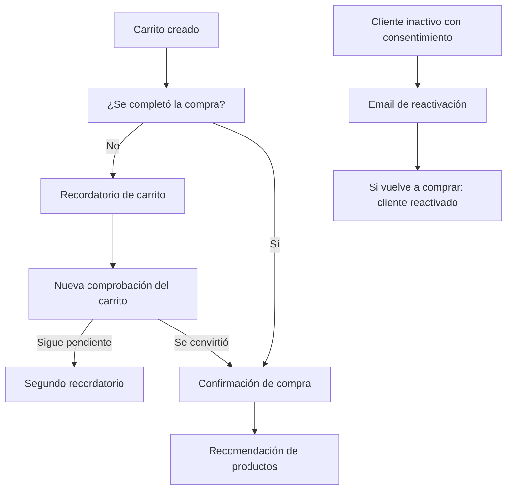

# Demo de automatización del ciclo de vida de clientes para e-commerce

Una demo de marketing automation que conecta **n8n**, **Supabase (PostgreSQL)** y **Brevo** para acompañar al cliente desde que deja productos en el carrito hasta la compra y la reactivación.

> **Alcance:** demostración con datos de prueba. Postman simula los eventos que, en una integración real, enviaría la plataforma de e-commerce. No se presentan métricas de impacto comercial porque esta demo no se ejecutó con tráfico real.

## El desafío

Un e-commerce necesita responder a distintos momentos del recorrido de compra sin depender de seguimientos manuales: recordar un carrito pendiente, confirmar una compra y volver a contactar a clientes inactivos con consentimiento.

## La solución

La demo automatiza esos momentos con tres workflows de negocio y un flujo de monitoreo:

| Workflow | Evento o frecuencia | Qué hace |
|---|---|---|
| **Abandoned Cart** | Se crea un carrito | Espera una hora, comprueba si se convirtió en compra y, si sigue pendiente, envía un recordatorio. Vuelve a comprobar el mismo carrito antes del segundo recordatorio. |
| **Post-Purchase** | Se confirma una compra | Marca el carrito como convertido, actualiza el contacto, envía la confirmación y, tres días después, consulta productos relacionados para enviar una recomendación. |
| **Reactivation** | Se ejecuta diariamente | Busca clientes inactivos por 90 días o más que aceptaron marketing y todavía no recibieron una campaña de reactivación. |
| **Monitoreo** | Se produce un resultado o error | Registra eventos de los workflows para facilitar su seguimiento. |

En la demo, los webhooks se prueban desde Postman y los datos de clientes, carritos, órdenes y productos viven en Supabase.

## Recorrido del cliente




## Qué sucede en cada workflow

### Carrito abandonado

1. Recibe el identificador del carrito y el email del cliente.
2. Espera una hora y consulta el estado del carrito en Supabase.
3. Si ya se convirtió en compra, detiene los recordatorios.
4. Si sigue pendiente, actualiza el contacto en Brevo y envía el primer email.
5. Espera 48 horas y consulta nuevamente ese carrito.
6. Si no hubo compra, envía el segundo recordatorio; si hubo compra, registra la recuperación.


### Confirmación de compra y recomendación

1. Recibe la orden confirmada.
2. Marca el carrito asociado como `converted` en Supabase.
3. Actualiza el contacto existente en Brevo y registra los datos de la compra.
4. Envía el email de confirmación.
5. Tres días después, consulta productos activos y con stock de las categorías compradas.
6. Envía una recomendación con nombre, precio e imagen cuando hay productos disponibles.

Las recomendaciones se calculan usando la relación entre `order_items.product_id` y `products.id`, y las categorías del catálogo. Así no se comparan productos solo por el texto de sus nombres.


### Reactivación

1. Se ejecuta diariamente a las 9:00.
2. Busca clientes sin compras recientes que tengan `marketing_opt_in = true` y `reactivation_sent_at` vacío.
3. Actualiza el contacto existente en Brevo y envía la campaña.
4. Registra la fecha del envío en Supabase para evitar repetir la campaña.


### Monitoreo

Los resultados y errores de los workflows se registran en `automation_logs`.


## Etapas del contacto

El atributo `FUNNEL_STAGE` de Brevo refleja el momento del cliente. Los workflows actualizan el mismo contacto usando su email.

| Etapa | Significado |
|---|---|
| `cart_abandoned` | Dejó un carrito sin completar |
| `customer` | Completó una compra |
| `winback_sent` | Recibió una campaña de reactivación |
| `reactivated` | Volvió a comprar después de la reactivación |

## Emails de la demo

La demo contempla cinco comunicaciones. Las capturas visuales se pueden agregar en `docs/images/emails/`.

| Email | Momento | Contenido |
|---|---|---|
| Recordatorio de carrito | Una hora después de crear el carrito | Invita a volver y completar la compra; aclara que puede ignorarse si ya compró. |
| Segundo recordatorio | Si el carrito sigue pendiente después de 48 horas | Vuelve a contactar al cliente solo si la consulta confirma que no compró. |
| Gracias por la compra | Al confirmarse la orden | Confirma que se recibió el pedido y que se está preparando. |
| Reactivación | Para clientes elegibles e inactivos | Busca recuperar el interés del cliente respetando su consentimiento de marketing. |
| Recomendación de productos | Tres días después de la compra | Muestra productos disponibles relacionados con las categorías de su compra, con nombre, precio e imagen. |

Nombres sugeridos para las capturas: `abandoned-cart-email.png`, `post-purchase-email.png`, `reactivation-email.png` y `product-recommendations-email.png`.

## Datos y seguimiento

La demo usa estas tablas de Supabase:

- `customers`: datos y consentimiento del cliente.
- `carts` y `cart_items`: estado y productos del carrito.
- `orders` y `order_items`: compras y sus productos.
- `products`: catálogo, categorías, precio, stock e imágenes.
- `automation_logs`: eventos de los workflows.

El monitoreo puede consultarse desde las vistas `v_workflow_status` y `v_dashboard_metrics`, definidas en [`docs/monitoring_schema.sql`](docs/monitoring_schema.sql). Las métricas dependen de las consultas de esas vistas; no representan resultados de una tienda en producción.


## Dashboard

Looker Studio puede conectarse a las vistas de monitoreo para visualizar ejecuciones, etapas del funnel y métricas definidas en SQL.


## Tecnologías

- **n8n:** orquestación de workflows, esperas, condiciones y webhooks.
- **Supabase / PostgreSQL:** datos de clientes, carritos, órdenes, catálogo y logs.
- **Brevo:** contactos, atributos de funnel y emails transaccionales o de marketing.
- **Postman:** simulación de eventos durante las pruebas.
- **Looker Studio:** visualización de métricas mediante vistas SQL.

## Validaciones realizadas

- Un carrito pendiente recibe un recordatorio.
- Un carrito convertido detiene los recordatorios posteriores.
- Una compra actualiza el estado del carrito y los datos del contacto.
- Las recomendaciones excluyen productos ya comprados y sin stock.
- La reactivación considera consentimiento y evita repetir envíos registrados.
- Los eventos y errores quedan disponibles para monitoreo.

## Para adaptar a una tienda real

La integración requiere conectar los webhooks al sistema de la tienda, configurar credenciales y plantillas de Brevo, y revisar los nombres de tablas, estados y relaciones según el esquema real. Las credenciales y claves API deben almacenarse en las credenciales de n8n; no deben guardarse en el repositorio.

## Estructura del proyecto

```text
.
├── README.md
├── workflows/
│   ├── abandoned-cart.json
│   ├── post-purchase.json
│   ├── reactivation.json
│   └── monitoreo-error-handler.json
└── docs/
    ├── monitoring_schema.sql
    └── images/
        ├── emails/
        ├── architecture-diagram.png
        ├── abandoned-cart-workflow.png
        ├── post-purchase-workflow.png
        ├── reactivation-workflow.png
        ├── monitoreo-error-handler-workflow.png
        ├── database-schema.png
        ├── looker-funnel.png
        └── looker-dashboard.png
```

