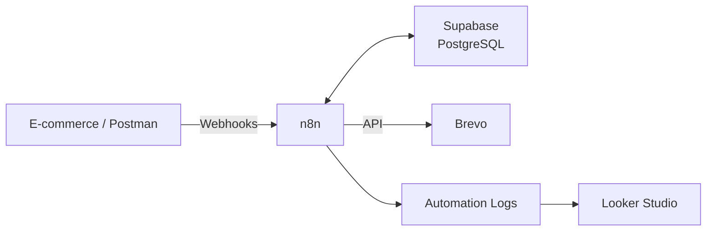

# E-commerce Customer Lifecycle Automation

Demo funcional de **Marketing Automation** para e-commerce, desarrollada con **n8n, Supabase (PostgreSQL) y Brevo**.

La solución automatiza diferentes etapas del ciclo de vida del cliente: **carritos abandonados, post-compra, recomendaciones de productos y reactivación de clientes inactivos**.

> La demo utiliza datos de prueba y Postman para simular los eventos que, en una implementación real, enviaría la plataforma de e-commerce mediante webhooks o APIs.

---

## 🎯 Objetivo

Automatizar comunicaciones basadas en el comportamiento del cliente, reduciendo seguimientos manuales y manteniendo trazabilidad de las acciones realizadas.

### Principales casos de uso

* 🛒 Recuperación de carritos abandonados.
* 📦 Confirmación y seguimiento post-compra.
* 🎯 Recomendación de productos relacionados.
* 🔄 Reactivación de clientes con **90 días o más sin realizar una compra**.
* ✅ Validación del consentimiento de marketing.
* 📊 Registro y monitoreo de ejecuciones.

---

## 🏗️ Arquitectura



---

## 🔄 Workflows

### 🛒 Abandoned Cart

* Recibe el evento de creación del carrito.
* Espera 1 hora y verifica si se realizó la compra.
* Si continúa pendiente, envía el primer recordatorio.
* Después de 48 horas vuelve a comprobar el carrito.
* Envía un segundo recordatorio únicamente si continúa pendiente.


### 📦 Post-Purchase

* Recibe la orden confirmada.
* Marca el carrito como `converted`.
* Actualiza el contacto en Brevo.
* Envía la confirmación de compra.
* Después de 3 días consulta productos relacionados con las categorías compradas.
* Envía una recomendación cuando existen productos disponibles.


### 🔄 Reactivation / Win-back

Busca diariamente clientes que:

```text
90+ días sin realizar una compra
marketing_opt_in = true
reactivation_sent_at IS NULL
```

Luego:

1. Actualiza el contacto en Brevo.
2. Envía la campaña de reactivación.
3. Registra la fecha del envío en Supabase.
4. Evita repetir automáticamente la misma campaña.


### 📊 Monitoring

Los resultados y errores de los workflows se registran en:

```text
automation_logs
```


---

## 📊 Dashboard de Métricas (Looker Studio)

Panel de monitoreo conectado en vivo a Supabase (PostgreSQL), con:

* **Estado de los workflows**: última ejecución de cada automatización (éxito/error).
* **Funnel de clientes**: cuántos están en cada etapa (carrito abandonado, cliente, reactivación en curso, reactivado).
* **Efectividad de las automatizaciones**: de los emails enviados en cada evento, cuántos terminaron en una compra.
* **Historial de eventos**: actividad reciente registrada por los 3 workflows.


---

## 🗂️ Datos

La solución utiliza:

| Tabla             | Función                   |
| ----------------- | ------------------------- |
| `customers`       | Clientes y consentimiento |
| `carts`           | Estado de los carritos    |
| `cart_items`      | Productos del carrito     |
| `orders`          | Compras                   |
| `order_items`     | Productos comprados       |
| `products`        | Catálogo                  |
| `automation_logs` | Eventos y ejecuciones     |

Las recomendaciones utilizan la relación entre `order_items` y `products` para identificar productos de categorías relacionadas.


---

## 📧 Comunicaciones

| Comunicación           | Trigger                                |
| ---------------------- | -------------------------------------- |
| Abandoned Cart         | 1 hora después                         |
| Segundo recordatorio   | 48 horas después si continúa pendiente |
| Compra confirmada      | Al recibir la orden                    |
| Product Recommendation | 3 días después de la compra            |
| Reactivation           | 90+ días sin compra + consentimiento   |

---

## 🛠️ Stack

**Automation:** n8n
**Database:** Supabase / PostgreSQL
**Email Marketing:** Brevo
**Testing:** Postman
**Analytics:** Looker Studio
**Integration:** Webhooks / REST APIs

---

## 📌 Alcance

Demo funcional desarrollada con **datos de prueba**, simulados mediante Postman.

El dashboard sí muestra métricas de efectividad (recordatorios enviados, tasa de conversión, recomendaciones aceptadas, etc.), pero corresponden a eventos de prueba generados manualmente — no a tráfico real de una tienda. El objetivo es demostrar la **capacidad de trazabilidad y medición** del sistema, no representar resultados comerciales reales.

En una implementación real, conectando los workflows con la plataforma de e-commerce y tráfico genuino de clientes, estas mismas vistas y el mismo dashboard reflejarían métricas de negocio reales sin necesidad de cambios en la arquitectura.

Esto deja claro que la infraestructura de medición es real y funcional, solo que corrida con datos de prueba en vez de tráfico real — que es justo el punto fuerte que querés mostrar (que el sistema mide, no que los números sean reales).

---

## 👩‍💻 Proyecto desarrollado por

**Ana Ferreira**

**AI Automation Specialist | Data Engineer Junior | AI Engineer en formación | BI & Data Analytics**

🔗 [Portfolio](https://portafolio-anaferreira.vercel.app/)
💻 [GitHub](https://github.com/Ana-FB)
💼 [LinkedIn](TU_LINKEDIN)

### Especialidades

`AI Automation`  · `Data Engineering` · `Data Analytics` · `Python` · `SQL` · `n8n` · `APIs & Webhooks`


