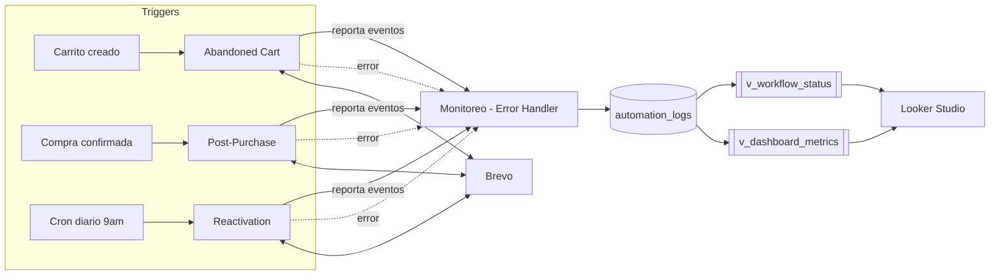

# 🔄 Automatización de Lifecycle de E-commerce (n8n + Supabase + Brevo)

Sistema de automatización de marketing lifecycle para e-commerce, construido con **n8n**, **Supabase (Postgres)** y **Brevo**. Cubre todo el ciclo de vida del cliente: carrito abandonado → compra → recomendación → reactivación, con monitoreo centralizado y métricas de efectividad en **Looker Studio**.

---

## 🎥 Demo en video

<!-- 📹 ESPACIO PARA EL VIDEO DEMO
     Opción 1 (YouTube): pegá el link abajo
     Opción 2 (subido al repo): usá un GIF o imagen clickeable que linkee al video
-->

[](PEGAR_LINK_DEL_VIDEO_ACA)

> 🔗 Link directo: `PEGAR_LINK_DEL_VIDEO_ACA`

---

## 🗺️ Arquitectura general



- **3 workflows de negocio** (Abandoned Cart, Post-Purchase, Reactivation) manejan la lógica de cada etapa del lifecycle.
- **1 workflow central de logging** ("Monitoreo - Error Handler") recibe los eventos de los otros 3 (éxitos y errores) y los guarda en **una sola tabla** de Postgres.
- **Brevo** guarda el estado del contacto (`FUNNEL_STAGE`) y envía todos los emails.
- **Looker Studio** se conecta directo a Postgres (2 vistas) para el panel de métricas y el funnel.

---

## 📦 Workflows

### 1. 🛒 Abandoned Cart

Cuando se crea un carrito sin comprar, intenta recuperarlo con hasta 2 recordatorios por email.

<!-- 📸 ESPACIO PARA CAPTURA: pantalla completa del workflow "Abandoned Cart" en n8n -->


**Flujo:**
1. Espera 1h → consulta el carrito en Supabase.
2. Si ya estaba `converted` (compró antes de cualquier email) → termina, registra `already_converted`.
3. Si sigue `active` → actualiza el contacto en Brevo (`FUNNEL_STAGE = cart_abandoned`) y manda el 1er recordatorio.
4. Espera 48h más → vuelve a consultar el mismo carrito.
5. Si convirtió → termina, registra `purchase_recovered` (recuperación real). Si no → manda el 2do recordatorio.

---

### 2. 🎉 Post-Purchase

Se dispara al confirmarse una compra. Actualiza Supabase y Brevo, y arma la secuencia de emails post-compra.

<!-- 📸 ESPACIO PARA CAPTURA: pantalla completa del workflow "Post-Purchase" en n8n -->


**Flujo:**
1. Marca el carrito de origen como `converted` en Supabase.
2. Calcula los totales reales (orden y carrito) por SQL.
3. Consulta el contacto en Brevo: si venía de una campaña de reactivación (`winback_sent`) → lo marca `reactivated`; si no → `customer`.
4. Envía el email de confirmación de compra.
5. Espera 3 días → busca productos recomendados de la misma categoría que aún no compró.
6. Si hay recomendaciones → las envía por HTTP a la API de Brevo (con imágenes y precios reales).

---

### 3. 🔁 Reactivation

Corre todos los días a las 9am. Busca clientes inactivos hace 90+ días y les manda una campaña de reactivación.

<!-- 📸 ESPACIO PARA CAPTURA: pantalla completa del workflow "Reactivation" en n8n -->


**Flujo:**
1. Registra que el cron corrió hoy (aunque no encuentre a nadie).
2. Busca en Supabase clientes con 90+ días sin comprar, `marketing_opt_in = true`, sin campaña previa.
3. Actualiza sus datos en Brevo y envía la campaña.
4. Marca `reactivation_sent_at` en Supabase (envío único) y `FUNNEL_STAGE = winback_sent` en Brevo.

---

### 4. 📊 Monitoreo - Error Handler

Hub central de logging. No corre solo — lo llaman los otros 3 workflows.

<!-- 📸 ESPACIO PARA CAPTURA: pantalla completa del workflow "Monitoreo - Error Handler" en n8n -->


**Dos formas de entrar:**
- **Error Trigger**: automático, cuando cualquiera de los 3 workflows falla.
- **Execute Workflow Trigger**: los 3 workflows lo llaman a propósito para reportar un evento exitoso.

**Qué hace:** normaliza el evento (error o éxito) → lo guarda en `automation_logs`. Eso es todo — el "estado actual" de cada workflow no se guarda aparte, se calcula con una vista (ver más abajo).

---

## 🧭 Funnel de cliente (`FUNNEL_STAGE`)

| Etapa | Significado | Quién la escribe |
|---|---|---|
| `cart_abandoned` | Tiene un carrito activo, no compró | Abandoned Cart |
| `customer` | Compró (compra normal) | Post-Purchase |
| `winback_sent` | 90+ días inactivo, se le mandó la campaña | Reactivation |
| `reactivated` | Recibió la campaña y volvió a comprar | Post-Purchase |

<!-- 📸 ESPACIO PARA CAPTURA: gráfico de funnel en Looker Studio -->


---

## 🗄️ Base de datos (Supabase / Postgres)

<!-- 📸 ESPACIO PARA CAPTURA: diagrama de tablas o vista del Table Editor de Supabase -->


### Tablas de negocio
`customers`, `orders`, `order_items`, `carts`, `cart_items`, `products` — el esquema real de tu tienda (no incluido acá, depende de tu implementación).

### Monitoreo: **1 sola tabla + 2 vistas**

| Objeto | Tipo | Contenido |
|---|---|---|
| `automation_logs` | Tabla | Historial completo de eventos de los 3 workflows (única tabla de monitoreo) |
| `v_workflow_status` | Vista | Estado actual (`ok`/`error`) de cada workflow — última fila de `automation_logs` por `workflow_name` |
| `v_dashboard_metrics` | Vista | Funnel + efectividad de recordatorios/recomendación/reactivación, todo en una sola vista |

> El SQL completo para crear la tabla y las 2 vistas desde cero está en [`docs/monitoring_schema.sql`](./docs/monitoring_schema.sql).

---

## 📐 SQL de la vista de métricas

<!-- 📸 ESPACIO PARA CAPTURA: el SQL Editor de Supabase corriendo el CREATE VIEW de v_dashboard_metrics -->


`v_dashboard_metrics` usa CTEs (`WITH ...`) para calcular cada métrica una sola vez, y devuelve todo en una sola tabla con una columna `category` para distinguir filas de funnel vs. efectividad:

| category | label | count_total | count_converted | conversion_rate_pct |
|---|---|---|---|---|
| funnel | cart_abandoned | 45 | — | — |
| funnel | customer | 30 | — | — |
| effectiveness | reminder_sent | 10 | 3 | 30.0 |
| effectiveness | reactivation_sent | 6 | 2 | 33.3 |

Ver el archivo completo en [`docs/monitoring_schema.sql`](./docs/monitoring_schema.sql).

---

## 📊 Panel de métricas (Looker Studio)

<!-- 📸 ESPACIO PARA CAPTURA: dashboard completo de Looker Studio -->


Ambas vistas se conectan directo por el **conector nativo de PostgreSQL** de Looker Studio (se conectan igual que una tabla):

- **`v_workflow_status`** → scorecard/tabla de 3 filas para el panel de salud (ok/error).
- **`v_dashboard_metrics`** → filtrada por `category = 'funnel'` para el gráfico de embudo, y por `category = 'effectiveness'` para la tabla de efectividad.

---

## ⚙️ Requisitos previos

- Instancia de **n8n** (self-hosted o cloud) con acceso a la API.
- Cuenta de **Brevo** con:
  - Atributos de contacto: `FUNNEL_STAGE`, `NOMBRE`, `APELLIDOS`, `CART_TOTAL`, `ORDER_TOTAL`.
  - Plantillas transaccionales: recordatorio de carrito (x2), confirmación de compra, recomendación, campaña de reactivación.
- Proyecto de **Supabase** con el esquema de negocio + `docs/monitoring_schema.sql`.
- Cuenta de **Google Looker Studio** con el conector nativo de PostgreSQL.

---

## 🚀 Setup

1. Importar los 4 workflows en n8n (ver `/workflows/*.json`).
2. Configurar credenciales: Postgres (Supabase) y Brevo (API key) en cada workflow.
3. Correr `docs/monitoring_schema.sql` en el editor SQL de Supabase.
4. Completar los `templateId` de Brevo en los nodos de envío de email.
5. Activar los workflows **Abandoned Cart**, **Post-Purchase** y **Monitoreo - Error Handler**. Activar **Reactivation** según tu cron deseado.
6. Conectar Looker Studio a Supabase (`v_workflow_status` y `v_dashboard_metrics`) y armar el dashboard.

---

## 📁 Estructura sugerida del repo

```
.
├── README.md
├── workflows/
│   ├── abandoned-cart.json
│   ├── post-purchase.json
│   ├── reactivation.json
│   └── monitoreo-error-handler.json
├── docs/
│   ├── monitoring_schema.sql
│   └── images/
│       ├── abandoned-cart-workflow.png
│       ├── post-purchase-workflow.png
│       ├── reactivation-workflow.png
│       ├── monitoreo-error-handler-workflow.png
│       ├── database-schema.png
│       ├── sql-dashboard-metrics-view.png
│       ├── looker-funnel.png
│       ├── looker-dashboard.png
│       └── video-thumbnail.png
```
